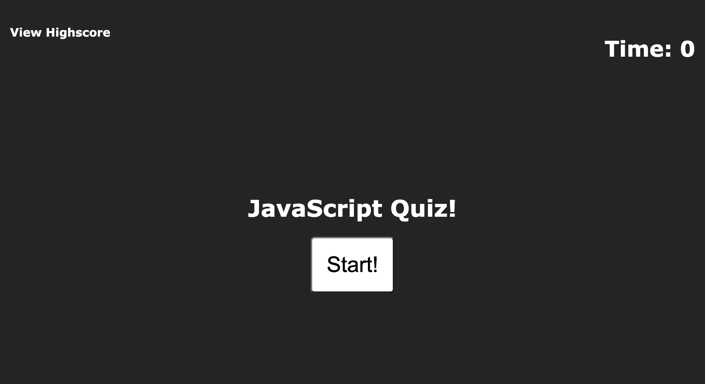

# Portfolio-Page-Advanced-CSS

This is my newly updated portfolio with added homework/projects. I have added links for my LinkedIn profile and a link for my resume.

For this assignment i have created my first Portfolio web application from scratch by applying the core skills i've recently learned as a portfolio of work can showcase your skills and talents to future employers looking to fill a full-time position.

I started off by organizing to make sure I was following the semantic structure of the HTML elements to make it more accessible. 

I decided to go for my picture and name just below my header and used display flex to space it evenly. Also when clicked on the navigation bars in the header the UI scrolls to the corresponding section.

I used display flex space evenly on the about me, projects and contact section. Put some box shadow on the image in the about me section and used borders for the projects so i could move them around more easily.

In the contact me section i linked my email and github accounts to the a tags and also when you click on the social media icons it will take you to the website.

## Deployed Application URLs: 
- https://anuur7.github.io/Portfolio-Page-Advanced-CSS/
- https://anuur7.github.io/Weather-Dashboard-Project/
- https://anuur7.github.io/JS-Code-Quiz-Project/
- https://anuur7.github.io/AHA-5-Food-/
- https://aqueous-brook-09754.herokuapp.com/
- https://secure-woodland-21895.herokuapp.com/notes

 